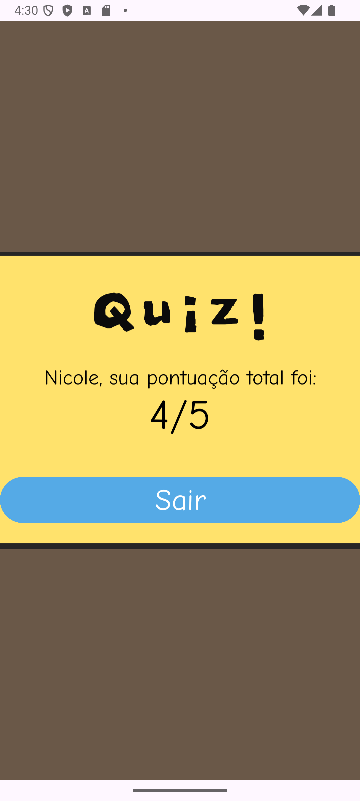

# Quiz de Placas de Trânsito (Android)

## Descrição

Este aplicativo Android, desenvolvido em Java, é um quiz interativo projetado para testar o conhecimento do usuário sobre placas de trânsito. O quiz apresenta 5 perguntas, cada uma exibida em uma tela separada. O usuário começa inserindo seu nome na tela inicial e, ao iniciar o quiz, navega por uma série de perguntas de múltipla escolha. A cada resposta correta, o usuário ganha um ponto. Ao final do quiz, a pontuação total é exibida na tela final.

## Funcionalidades

* **Tela Inicial:**
    * Permite ao usuário inserir seu nome.
    * Botão "Iniciar" para começar o quiz.
* **Perguntas do Quiz:**
    * Cada pergunta é exibida em uma tela individual.
    * Apresenta a imagem de uma placa de trânsito.
    * Oferece opções de múltipla escolha para a resposta.
    * Botão "Confirmar" para selecionar a resposta e avançar para a próxima pergunta.
* **Sistema de Pontuação:**
    * 1 ponto é concedido para cada resposta correta.
    * A pontuação é acumulada ao longo do quiz.
* **Tela de Resultado:**
    * Exibe a pontuação total do usuário ao final do quiz.
* **Navegação:**
    * Navegação sequencial entre as perguntas.
* **Botão Sair:**
    * Disponível para encerrar o aplicativo.

## Telas do Aplicativo

<table>
  <tr>
    <td style="text-align:center;">
      <b>Tela Inicial</b><br>
      
    </td>
    <td style="text-align:center;">
      <b>Tela da Pergunta 1</b><br>
      
    </td>
    <td style="text-align:center;">
      <b>Tela da Pergunta 2</b><br>
      
    </td>
    <td style="text-align:center;">
      <b>Tela da Pergunta 3</b><br>
      
    </td>
    <td style="text-align:center;">
      <b>Tela da Pergunta 4</b><br>
      
    </td>
    <td style="text-align:center;">
      <b>Tela da Pergunta 5</b><br>
      
    </td>
    <td style="text-align:center;">
      <b>Tela de Resultado</b><br>
      
    </td>
  </tr>
</table>

## Tecnologias Utilizadas

* **Java:** Linguagem de programação principal para o desenvolvimento Android.
* **Android SDK:** Conjunto de ferramentas de desenvolvimento para criar aplicativos Android.
* **Android Studio:** Ambiente de Desenvolvimento Integrado (IDE) para desenvolvimento Android.
* **XML:** Utilizado para definir o layout da interface do usuário.
* **Gradle:** Sistema de automação de build.

## Estrutura do Projeto

O projeto está organizado da seguinte forma:

* **`app/src/main/java/com/example/quiz/`**:
    * `MainActivity.java`: Lógica da tela inicial, coleta do nome do usuário e inicia o quiz.
    * `Tela2.java`, `Tela3.java`, `Tela4.java`, `Tela5.java`, `Tela7.java`: Lógica para cada tela de pergunta, exibição da placa, opções de resposta, verificação da resposta e atualização da pontuação.
    * `Tela6.java`: Lógica para a tela final, exibição da pontuação.
* **`app/src/main/res/layout/`:**
    * `activity_main.xml`: Layout da tela inicial.
    * `activity_tela2.xml`, `activity_tela3.xml`, `activity_tela4.xml`, `activity_tela5.xml`, `activity_tela7.xml`: Layout para cada tela de pergunta.
    * `activity_tela6.xml`: Layout da tela de resultado.
* **`app/src/main/res/drawable/`:**
    * Armazena as imagens das placas de trânsito utilizadas no quiz.

## Como Executar o Projeto

1.  **Pré-requisitos:**
    * Android Studio instalado.
    * Dispositivo Android físico ou emulador configurado.
2.  **Clone o repositório:**

    ```bash
    git clone https://github.com/NicoleTrujillano/quiz-placas-de-transito.git
    cd quiz-placas-de-transito
    ```
3.  **Abra o projeto no Android Studio.**
4.  **Sincronize o projeto com o Gradle.**
5.  **Execute o aplicativo** no seu dispositivo ou emulador.

## Contribuição

Contribuições são bem-vindas! Se você tiver sugestões de melhorias, correções de bugs ou novas funcionalidades, por favor, siga os seguintes passos:

1.  Crie um fork do repositório.
2.  Crie um branch para a sua contribuição (`git checkout -b minha-contribuicao`).
3.  Faça as alterações desejadas.
4.  Faça commit das suas alterações (`git commit -m "Adiciona nova funcionalidade"`).
5.  Faça push para o branch (`git push origin minha-contribuicao`).
6.  Abra um Pull Request para o branch `master` do repositório original.

## Autor

Nicole Trujillano [LinkedIn](https://www.linkedin.com/in/nicole-trujillano-292aa4358/)
